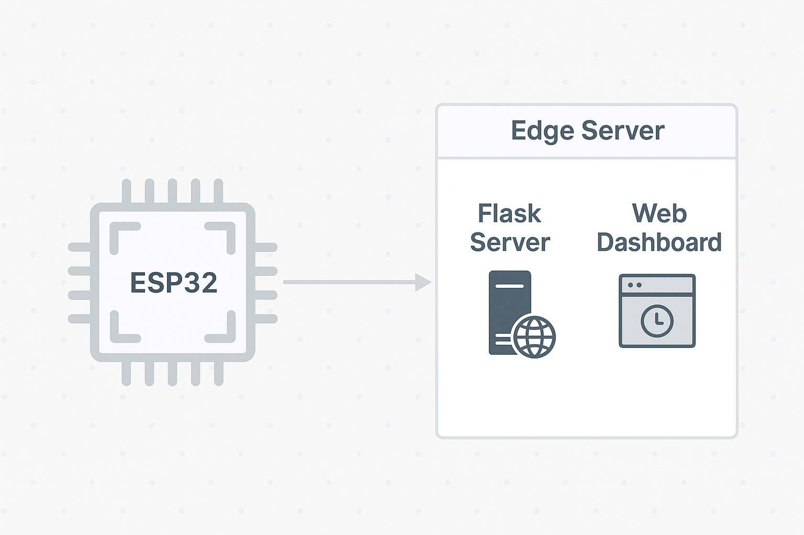

# Elderly Care Monitoring System

## Overview
An IoT-based elderly care monitoring system designed to provide safety and health monitoring for seniors living independently. The system addresses the fact that over 92% of seniors live in private dwellings rather than residential care facilities, providing a technological solution for remote monitoring and fall detection.

## Hardware Architecture
The system is built around an **ESP32-WROOM** microcontroller that connects to multiple sensors and actuators, implementing an **Edge Computing** architecture where heavy computations are offloaded to a backend server.

### Hardware Requirements
- **ESP32-WROOM** development board
- **Temperature and Humidity Sensor** (Environmental monitoring)
- **Accelerometer and Gyroscope** (Fall detection)
- **Tilt Switch** (Fall detection backup)
- **Proximity Sensor** (Collision detection)
- **2x Breadboards** (Due to the number of connections required)
- **Jumper wires and connectors**
- **Components from Egeloo Mega Starter Kit** (except ESP32)

See the image below to check out the circuit connections:


### Why Two Breadboards?
The project requires numerous Ground, GPIO, and power connections for all sensors. A single breadboard was insufficient to accommodate all the required connections cleanly. You might be able to make do with just one, depending on the width of your board.

## Software Architecture
The system uses a **hybrid Edge Computing approach**:
- **ESP32**: Handles sensor data collection and basic processing
- **Web Server**: Performs heavy computations including:
  - Status summary generation
  - Fall detection algorithms
  - Data aggregation and analysis



This architecture offloads computational weight from the ESP32's limited 240MHz processor to more powerful server hardware.

## Features Implemented

### 1. Personal Information Management
- User identification and profile data
- Age and health condition tracking
- Personalized monitoring parameters

### 2. Environmental Monitoring
- **Temperature sensing** for comfort and safety
- **Humidity monitoring** for health considerations
- **Future capability**: Light sensors for darkness detection

### 3. Safety Alerts System
- **Proximity alerts** for collision detection
- **Fall detection** using multiple sensors:
  - Accelerometer and gyroscope data
  - Tilt switch as backup detection
  - Impact analysis and movement tracking

### 4. Web Dashboard
- Simple, accessible interface designed for elderly users
- Real-time sensor data visualization
- Clear navigation and high visibility design
- Three main sections: Personal Info, Environmental Data, and Alerts

## Arduino IDE Setup

### 1. Install Arduino IDE
- Download from [arduino.cc](https://www.arduino.cc/en/software)
- Install following your OS instructions

### 2. ESP32 Board Configuration
1. Add ESP32 board package:
   - Go to **File > Preferences**
   - Add this URL to "Additional Board Manager URLs":
     ```
     https://dl.espressif.com/dl/package_esp32_index.json
     ```
2. Install ESP32 boards:
   - Go to **Tools > Board > Board Manager**
   - Search for "ESP32" and install "ESP32 by Espressif Systems"
3. Select your board:
   - **Tools > Board > ESP32 Arduino > ESP32 Dev Module**
4. Connect ESP32 via USB and select port:
   - **Tools > Port > COMX**

### 3. Required Libraries
Install these libraries through **Sketch > Include Library > Manage Libraries**:
- **WiFi** (usually pre-installed with ESP32)
- **HTTPClient** (for server communication)
- **ArduinoJson** (for data formatting)
- **Adafruit Sensor libraries** (depending on your specific sensors)
- Any specific sensor libraries for your hardware

### 4. Upload the Sketch
1. Open the main `.ino` file in Arduino IDE
2. Configure your WiFi credentials and server endpoints in the code
3. Verify the code (✓ button)
4. Upload to ESP32 (→ button)
5. Monitor via **Tools > Serial Monitor** (115200 baud rate recommended)

## System Workflow
1. **ESP32** collects data from all connected sensors
2. **Data processing** occurs locally for basic filtering
3. **Heavy computations** (fall detection, status analysis) happen on web server
4. **Dashboard** displays real-time data and alerts
5. **Alerts** are generated based on sensor thresholds and ML analysis

## Challenges Addressed

### 1. Sensor Data Management
- **Volume**: Large amounts of verbose sensor data
- **Relevance**: Filtering meaningful information from noise
- **Error handling**: Ignoring erroneous readings and sensor drift

### 2. Fall Detection Complexity
- **Acceleration analysis**: Distinguishing falls from normal activities (lying down)
- **Impact measurement**: Analyzing disruption levels and post-impact movement
- **Time-based analysis**: Considering fall duration vs. movement speed
- **Multi-metric aggregation**: Weighting different sensor inputs appropriately

### 3. Rule-Based System Limitations
- Dynamic environments require adaptive algorithms
- Simple threshold-based rules insufficient for complex scenarios
- Need for machine learning integration

## Future Development Roadmap

### Immediate (Current Phase)
- **Enhanced sensors**: ECG for heart rate monitoring
- **Diabetes monitoring**: Sweat sensors for glucose level indication
- **Improved algorithms**: Better rule-based fall detection

### Short Term
- **Machine Learning integration**: Training with SisFall Dataset
- **Advanced fall detection**: Replace rule-based system with ML models
- **Data analytics**: Historical trend analysis

### Long Term
- **Product design**: Professional packaging and enclosure
- **Commercial viability**: Market-ready product development
- **Scalability**: Multi-user monitoring platform

## Installation & Usage

### Hardware Setup
1. Connect sensors to ESP32 according to circuit diagram
2. Use two breadboards for organized connections
3. Ensure stable power supply for all components

### Software Setup
1. Upload code to ESP32 using Arduino IDE
2. Configure web server and database
3. Access dashboard through web interface
4. Calibrate sensors for individual user

### Monitoring
- Real-time data visible on web dashboard
- Alerts automatically generated for concerning events
- Historical data available for trend analysis

## Troubleshooting

### Common ESP32 Issues
- **Connection problems**: Check USB cable and drivers
- **Upload failures**: Hold BOOT button during upload if needed
- **WiFi issues**: Verify network credentials and signal strength

### Sensor Issues
- **Erratic readings**: Check connections and power supply
- **Calibration needed**: Reset sensor baselines in code
- **Range problems**: Ensure sensors are within specified operating ranges

## Contributing
This project welcomes contributions in:
- Sensor integration improvements
- Machine learning algorithm development
- Web interface enhancements
- Hardware optimization

## Technical Specifications
- **Microcontroller**: ESP32-WROOM (240MHz, WiFi/Bluetooth)
- **Architecture**: Edge computing with server-side processing
- **Communication**: WiFi-based data transmission
- **Processing**: Hybrid local/remote computation model
